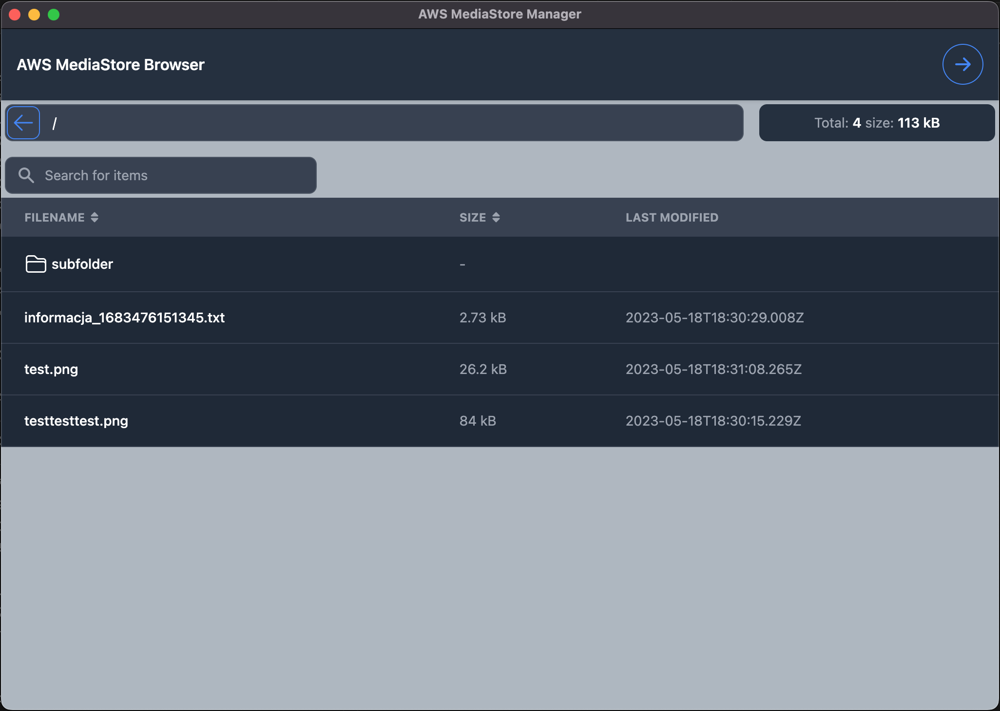

## AWS MEDIA STORE Manager

Simple Application allowing you to easly browse AWS MediaStore files. As Amazon interface is unusable for that with this application you can browse the files the same way as using typical file manager.

## TODOs

- [x] UPDATE DEPEDENCIES
- [x] ADD THE UI
- [x] New Session Screen (AWS KEY , AWS SECRET)
- [x] Show the root folder of container UI
- [x] Close the session
- [x] Sorting table
- [x] Navigate to folders
- [x] Filter by name
- [ ] Deploy installable version
- [ ] Update Readme
- [ ] Delete files
